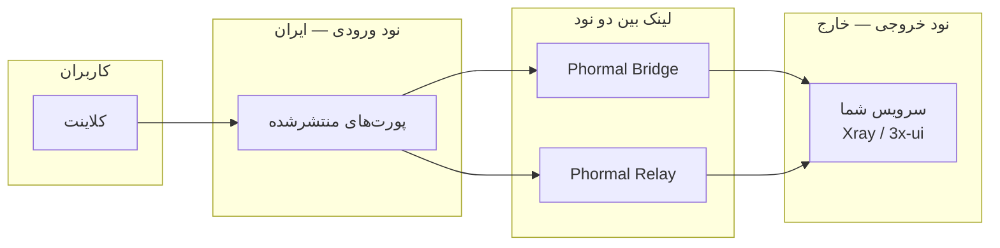

<h1 align="center">🌀 Phormal Tunnel</h1>

<p align="center">
  <em>یک لایه‌ی تونلینگ سریع و مقاوم برای اتصال دو سرور از میان شبکه‌های فیلترشده.</em>
</p>

<p align="center">
  
  
  
  
</p>

<p align="center">
  <a href="https://github.com/Schmi7zz">گیت‌هاب</a> ·
  <a href="https://t.me/SchmitzWS">تلگرام</a> ·
  <a href="./README.md">🇬🇧 English</a>
</p>

---

<div dir="rtl">

## ✨ Phormal چیست؟

**Phormal** یک **نود ورودی** (سرور داخل ایران با اینترنت محدود) را به یک **نود خروجی** (سرور خارج با اینترنت تمیز) وصل می‌کند، سپس پورت‌های سرویس شما را روی نود ورودی منتشر می‌کند تا کاربرها به **آی‌پی عمومی نود ایران** وصل شوند — نه به سرور خارج.

دو حالت دارد و هر دو **چندتونله** هستند — یک سرور می‌تواند چند لینک/تونل مستقل را هم‌زمان اجرا کند:

| حالت | مناسب برای | نحوه‌ی کار |
| ---- | --------- | --------- |
| 🌉 **Phormal Bridge** | مسیرهای پایدار بین دو سرور | لینک خصوصی IPv6 (SIT) + انتشار پورت |
| 🛰️ **Phormal Relay** | مسیرهای پرافت و فیلترشده | تونل QUIC با مبهم‌سازی Salamander |

</div>



<div dir="rtl">

---

## 🆕 تازه‌ها

- **چندتونله در هر دو حالت.** حالا هم **Bridge** و هم **Relay** بر پایه‌ی **نمونه‌های نام‌دار** ساخته شده‌اند؛ هر کدام کانفیگ، پورت، رمز و سرویس systemd مخصوص خودش را دارد.
  - **یک خارج ← چند ایران.** یک سرور خارج می‌تواند به هر تعداد سرور ایران سرویس بدهد. در Relay یک تونل خروجی مشترک است؛ در Bridge چون SIT نقطه‌به‌نقطه است، برای هر ایران یک «لینک خروجی» جدا می‌سازی.
  - یک سرور می‌تواند **چند تونل هم‌زمان** داشته باشد (مثلاً ورودی به سه خارج مختلف).
- **مدیریت تک‌به‌تک.** لیست، ری‌استارت، توقف، شروع، عیب‌یابی، لاگ زنده، ویرایش پورت‌ها، تغییر آی‌پی مقصد، تغییر پورت لینک یا bridge key، تغییر MTU، ویرایش کانفیگ خام و حذف — **هر کدام مخصوص یک تونل**.
- **رفع باگ «ری‌استارت دو طرف» (Relay).** کلاینت حالا بلافاصله وصل می‌شود و تونل را با keepalive گرم نگه می‌دارد، به‌جای اتصال با تأخیر که اولین هندشیک را خراب می‌کرد. `fastOpen` و یک تأخیر کوتاه در بوت هم اضافه شد.
- **منوی مقاوم.** اگر یک گزینه خطا بدهد دیگر کل برنامه بسته نمی‌شود؛ فقط پیام می‌دهد و به منو برمی‌گردد.

---

## ⚙️ پیش‌نیازها

- **سیستم‌عامل:** لینوکس (ترجیحاً Debian / Ubuntu)
- **دسترسی:** روت (`sudo phormal`)
- **سرورها:** دو سرور یا بیشتر — ورودی‌ها و خروجی‌ها
- **شبکه:** دسترسی UDP بین نودها (برای پورت لینک رله)

---

## 🚀 نصب

**با یک دستور** — دانلود، اصلاح line ending و اجرا:

</div>

```bash
curl -fsSL https://raw.githubusercontent.com/Schmi7zz/Phormal/main/phormal.sh -o phormal.sh && sed -i 's/\r$//' phormal.sh && chmod +x phormal.sh && sudo ./phormal.sh
```

<div dir="rtl">

بعد از اولین اجرا، از هر جا با این دستور اجرایش کن:

</div>

```bash
sudo phormal
```

<div dir="rtl">

---

## 🛰️ Phormal Relay — پیشنهادی برای ایران ↔ خارج

> یک تونل خروجی (خارج) می‌تواند بین **هر تعداد** تونل ورودی (ایران) به اشتراک گذاشته شود — پورت لینک و رمزها یکی، ولی پورت‌های کاربر برای هر ورودی می‌تواند فرق کند.

**۱. روی نود خارج — منو `5` · Add exit tunnel**
- یک نام بگذار (مثلاً `kharej-de`) و یک **پورت لینک** انتخاب کن (UDP، مثلاً `8531`)
- رمز **auth** و **obfuscation** که نمایش می‌دهد را یادداشت کن
- در فایروال بازش کن: `ufw allow 8531/udp`
- سرویس واقعی (Xray / 3x-ui) را روی پورت کاربر (مثلاً `5151`) بالا بیاور

**۲. روی هر نود ایران — منو `6` · Add entry tunnel**
- یک نام بگذار (مثلاً `iran1`)، **آی‌پی خارج**، **همان پورت لینک** و **همان دو رمز** را وارد کن
- **پورت‌های کاربر** برای انتشار را وارد کن (مثلاً `5151`)

**۳. کاربر را به نود ایران وصل کن**

</div>

```text
  کاربر  →  ایران:5151  →  [ لینک QUIC :8531 ]  →  خارج:5151  →  Xray
```

<div dir="rtl">

| نوع پورت | نمونه | چه کسی وصل می‌شود |
| -------- | ----- | ---------------- |
| 🔗 پورت لینک | `8531` | فقط بین ایران و خارج (UDP) |
| 👤 پورت کاربر | `5151` | کاربرهای VPN شما (از طریق آی‌پی ایران) |

**امکانات رله:** مبهم‌سازی Salamander · کنترل پهنای باند · پورت‌هاپینگ اختیاری · بهینه‌سازی BBR + `fq`.

---

## 🌉 Phormal Bridge — چندتونله، برای مسیرهای پایدار

تونل SIT نقطه‌به‌نقطه است، پس **یک خارج با ساختن یک لینک خروجی برای هر ایران، به چند ایران سرویس می‌دهد** — هر کدام با bridge key مخصوص خودش.

**۱. روی نود خارج — منو `1` · Add exit link** *(برای هر ایران تکرار کن)*
- یک نام بگذار (مثلاً `iran1`)، آی‌پی این خارج و آی‌پی ایران مقابل را وارد کن
- **bridge key** که نمایش می‌دهد را یادداشت کن
- سرویست را روی پورت‌هایی که می‌خواهی منتشر کنی بالا بیاور

**۲. روی هر نود ایران — منو `2` · Add entry link**
- یک نام بگذار، آی‌پی این نود و آی‌پی خارج را وارد کن
- **همان bridge key** لینک خروجی متناظر را وارد کن
- ترنسپورت (`tcp` / `udp` / `grpc`) و **پورت‌های کاربر** را انتخاب کن

**۳. کاربر را به `آی‌پی ایران : پورت منتشرشده` وصل کن.**

**پیش‌فرض‌ها:** اینترفیس هر لینک `phm-<name>`، MTU برابر `1360`، بهینه‌سازی BBR + `fq`، MSS clamping.

---

## 🧭 راهنمای منو

### 🌉 Phormal Bridge (چندتونله)

| # | کار |
| - | --- |
| ۱ | Add exit link (این سرور = خارج) — برای هر ایران یکی |
| ۲ | Add entry link (این سرور = ایران) |
| ۳ | Manage links — لیست / ویرایش / حذف / ری‌استارت هر لینک |
| ۴ | اسپیدتست |

### 🛰️ Phormal Relay (چندتونله)

| # | کار |
| - | --- |
| ۵ | Add exit tunnel (این سرور = خارج) |
| ۶ | Add entry tunnel (این سرور = ایران) |
| ۷ | Manage tunnels — لیست / ویرایش / حذف / ری‌استارت هر تونل |
| ۸ | اسپیدتست |

**Manage** (لینک‌ها یا تونل‌ها) همه‌ی نمونه‌ها را لیست می‌کند، سپس برای هر کدام:
ری‌استارت · توقف · شروع · عیب‌یابی/پینگ · لاگ زنده · ویرایش پورت‌ها · تغییر آی‌پی مقصد · تغییر پورت لینک یا bridge key · تغییر MTU · ویرایش کانفیگ خام · حذف.

### 🛠️ مدیریت کلی

| # | کار |
| - | --- |
| ۹ | Status — همه‌ی لینک‌های Bridge و تونل‌های Relay |
| ۱۰ | Phormal tuning — BBR + `fq` (متعادل) یا `cake` (تأخیر کم) |
| ۱۱ | زمان‌بندی Auto-refresh — ری‌استارت دوره‌ای با cron |
| ۱۲ | حذف کامل |
| ۰ | خروج |

> MTU حالا **به‌ازای هر لینک** داخل Manage → Change MTU تنظیم می‌شود (اول `1360`، بعد `1280` اگر آپلود گیر کرد).

---

## 📊 اسپیدتست

دو مرحله، روی **هر دو نود** با فاصله‌ی حدود ۳۰ ثانیه.

- **Relay:** خارج → منو **۸** → مرحله **۱** (listener)، بعد ایران → منو **۸** → مرحله **۲** (تونل را انتخاب کن).
- **Bridge:** خارج → منو **۴** → لینک را انتخاب کن → مرحله **۱**، بعد ایران → منو **۴** → لینک → مرحله **۲**.

---

## 🗂️ فایل‌ها و سرویس‌ها

| مسیر | کاربرد |
| ---- | ------ |
| `/etc/phormal/bridge/<name>/meta.conf` | تنظیمات هر لینک Bridge |
| `/etc/phormal/relay/<name>/meta.conf` | تنظیمات هر تونل Relay |
| `/etc/phormal/relay/<name>/config.yaml` | کانفیگ موتور هر تونل Relay |
| `/etc/phormal/tls/` | گواهی self-signed مشترک |
| `/var/log/phormal.log` | فایل لاگ Phormal |

| سرویس | حالت |
| ----- | ---- |
| `phormal-core@<name>.service` | هر لینک SIT یکی |
| `phormal-guard@<name>.service` | keepalive هر لینک |
| `phormal-bfwd@<name>.service` | انتشار پورت هر لینک ورودی |
| `phormal-relay@<name>.service` | هر تونل Relay یکی |

---

## 🩺 عیب‌یابی

**کاربر وصل نمی‌شود (Relay)**
۱. مطمئن شو کاربر از **آی‌پی ایران + پورت کاربر** استفاده می‌کند، نه آی‌پی خارج یا پورت لینک.
۲. رمزها و پورت لینک روی هر دو نود دقیقاً یکی باشند.
۳. اول **خارج** بعد **ایران** را ری‌استارت کن.
۴. روی هر دو نود **Manage tunnels → انتخاب تونل → Diagnostics** را اجرا کن.
۵. از ایران دسترسی UDP به خارج را تست کن: `nc -zvu EXIT_IP LINK_PORT`

**`connect error: timeout`** — لینک بین دو نود قطع است، نه کانفیگ VPN. مطمئن شو تونل خارج بالاست و پورت UDP لینک باز است.

**`connection refused` روی خارج** — تونل سالم است ولی سرویست روی آن پورت گوش نمی‌دهد. Xray / 3x-ui را روی پورت کاربر بالا بیاور (روی `0.0.0.0` یا `127.0.0.1`).

**Bridge: peer unreachable** — لینک متناظر را روی نود مقابل با **همان bridge key** بالا بیاور، بعد **Manage links → انتخاب لینک → Ping peer**. اگر آپلود گیر کرد MTU را پایین بیاور.

**دیدن لاگ‌ها**

</div>

```bash
journalctl -u 'phormal-relay@*' -f
journalctl -u 'phormal-core@*' -f
journalctl -u 'phormal-bfwd@*' -f
```

<div dir="rtl">

---

## 🔄 به‌روزرسانی

</div>

```bash
curl -fsSL https://raw.githubusercontent.com/Schmi7zz/Phormal/main/phormal.sh -o /usr/local/bin/phormal && sed -i 's/\r$//' /usr/local/bin/phormal && chmod +x /usr/local/bin/phormal && sudo phormal
```

<div dir="rtl">

---

## 🙌 سازندگان

- **نویسنده:** [Schmi7z](https://github.com/Schmi7zz)
- **کانال:** [@SchmitzWS](https://t.me/SchmitzWS)

## 📄 لایسنس

GPL-3.0 — فایل [LICENSE](LICENSE.txt) را ببین.

</div>
