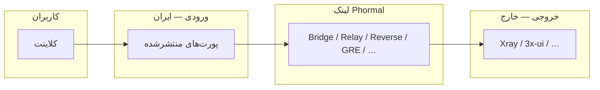

<h1 align="center">🌀 Phormal Tunnel</h1>

<p align="center">
  <em>یک لایه‌ی تونلینگ سریع و مقاوم برای اتصال سرور ورودی و خروجی از میان شبکه‌های فیلترشده.</em>
</p>

<p align="center">
  
  
  
  
</p>

<p align="center">
  <a href="https://github.com/Schmi7zz">گیت‌هاب</a> ·
  <a href="https://t.me/SchmitzWS">تلگرام</a> ·
  <a href="./README.md">🇬🇧 English</a>
</p>

---

<div dir="rtl">

## ✨ Phormal چیست؟

**Phormal** نود **ورودی** (ایران / uplink محدود) را به نود **خروجی** (خارج / uplink تمیز) وصل می‌کند و پورت‌های سرویس را روی **آی‌پی عمومی ایران** منتشر می‌کند — کاربران مستقیماً به خارج وصل نمی‌شوند.

هر محصول **چندتونله** است: چند نمونه‌ی نام‌دار روی یک سرور، هر کدام با کانفیگ و systemd جدا.

| محصول | مناسب برای | لایه / موتور |
| ----- | ---------- | ------------- |
| 🌉 **Phormal Bridge** | مسیر پایدار نقطه‌به‌نقطه | SIT + gost |
| 🛰️ **Phormal Relay** | UDP فیلترشده / پرافت | Hysteria2 QUIC |
| 🔁 **Phormal Reverse** | اتصال معکوس TCP | rathole |
| 🪨 **Phormal GRE** | وقتی SIT بسته است | GRE / IPIP کرنل |
| 📡 **Phormal Echo** | مسیر ICMP باز | icmp_tun |
| 🧱 **Phormal Raw** | UDP با ظاهر faketcp | udp2raw |
| 🌊 **Phormal Stream** | تونل TCP پایدار | Backhaul TCP |
| 🥷 **Phormal Cloak** | شبیه TLS / WebSocket | Backhaul WSS |
| 🌐 **Phormal DNS** | فقط DNS | iodine |
| ⚡ **Phormal Edge** | فوروارد TCP سبک | proxyforwarder |

</div>



<div dir="rtl">

---

## 🚀 نصب

</div>

```bash
curl -fsSL https://raw.githubusercontent.com/Schmi7zz/Phormal/main/phormal.sh -o phormal.sh && sed -i 's/\r$//' phormal.sh && chmod +x phormal.sh && sudo ./phormal.sh
```

<div dir="rtl">

بعد از اولین اجرا:

</div>

```bash
sudo phormal
```

<div dir="rtl">

### میرور (ایران — دانلود سریع باینری)

روی سرور میرور:

</div>

```bash
sudo bash mirror-host-setup.sh
```

<div dir="rtl">

مقدار `MIRROR_BASE` در `/etc/phormal/phormal.conf` به‌صورت خودکار تنظیم می‌شود.

---

## 🧪 Phormal Path Test (منو **۱**)

**همیشه اول** این را برای هر جفت ایران ↔ خارج اجرا کن.

- **همه** محصولات را با ترافیک واقعی دوطرفه تست می‌کند.
- به **SSH سرور مقابل** نیاز دارد (کلید ترجیحی؛ پسورد هم کار می‌کند — یک‌بار در هر تست پرسیده می‌شود).
- جدول PASS/FAIL و **شماره منوی مناسب** را نشان می‌دهد.

آی‌پی / پورت / کاربر SSH آخرین peer در `phormal.conf` ذخیره می‌شود.

---

## 🧭 راهنمای منو (نسخه ۵.۴.۰)

### تست مسیر

| # | کار |
| - | --- |
| **۱** | اجرای تست خودکار مسیر (SSH به peer) |

### محصولات اصلی

| # | محصول | خروج | ورود | مدیریت |
| - | ----- | ---- | ---- | ------ |
| ۲–۵ | **Bridge** | ۲ | ۳ | ۴ (+۵ اسپیدتست) |
| ۶–۹ | **Relay** | ۶ | ۷ | ۸ (+۹ اسپیدتست) |
| ۱۰–۱۲ | **Reverse** | ۱۰ | ۱۱ | ۱۲ |

### محصولات تکمیلی

| # | محصول | خروج | ورود | مدیریت |
| - | ----- | ---- | ---- | ------ |
| ۱۳–۱۵ | **GRE** | ۱۳ | ۱۴ | ۱۵ |
| ۱۶–۱۸ | **Echo** | ۱۶ | ۱۷ | ۱۸ |
| ۱۹–۲۱ | **Raw** | ۱۹ | ۲۰ | ۲۱ |
| ۲۲–۲۴ | **Stream** | ۲۲ | ۲۳ | ۲۴ |
| ۲۵–۲۷ | **Cloak** | ۲۵ | ۲۶ | ۲۷ |
| ۲۸–۳۰ | **DNS** | ۲۸ | ۲۹ | ۳۰ |
| ۳۱–۳۳ | **Edge** | ۳۱ | ۳۲ | ۳۳ |

### مدیریت کلی

| # | کار |
| - | --- |
| ۳۴ | Status — همه تونل‌ها |
| ۳۵ | Phormal tuning |
| ۳۶ | زمان‌بندی auto-refresh |
| ۳۷ | حذف کامل |
| ۰ | خروج |

---

## 🛰️ شروع سریع — Phormal Relay

**خارج — منو ۶:** نام تونل، پورت لینک UDP، رمزها، فایروال، سرویس روی پورت کاربر.

**ایران — منو ۷:** آی‌پی خارج، همان پورت و رمزها، پورت‌های کاربر.

کاربر → **آی‌پی ایران : پورت کاربر**

---

## 🌉 شروع سریع — Phormal Bridge

SIT نقطه‌به‌نقطه است — **برای هر ایران یک لینک خروجی** روی خارج.

- **خارج — منو ۲:** نام، IPها، **bridge key**
- **ایران — منو ۳:** همان key، ترنسپورت، پورت‌ها

---

## 🗂️ فایل‌ها و سرویس‌ها

| مسیر | کاربرد |
| ---- | ------ |
| `/etc/phormal/bridge/<name>/` | Bridge |
| `/etc/phormal/relay/<name>/` | Relay |
| `/etc/phormal/reverse/<name>/` | Reverse |
| `/etc/phormal/<product>/<name>/` | GRE, Echo, Raw, Stream, … |
| `/etc/phormal/phormal.conf` | میرور، پیش‌فرض SSH تست |

الگوی سرویس: `phormal-relay@<name>` ، `phormal-gre@<name>` ، `phormal-btcp@<name>` و غیره.

---

## 🩺 عیب‌یابی

**SSH تست مسیر خطا می‌دهد**

- کلید SSH بگذار یا موقع پرامپت پسورد root سرور مقابل را وارد کن.
- تست دستی: `ssh root@PEER_IP echo OK`

**کاربر Relay timeout می‌گیرد**

- کاربر باید **آی‌پی ایران + پورت کاربر** بزند، نه IP خارج یا پورت لینک.
- اول خارج، بعد ایران را ری‌استارت کن.

**لاگ**

</div>

```bash
journalctl -u 'phormal-relay@*' -f
journalctl -u 'phormal-core@*' -f
journalctl -u 'phormal-btcp@*' -f
```

<div dir="rtl">

---

## 🔄 به‌روزرسانی

</div>

```bash
curl -fsSL https://raw.githubusercontent.com/Schmi7zz/Phormal/main/phormal.sh -o /usr/local/bin/phormal && sed -i 's/\r$//' /usr/local/bin/phormal && chmod +x /usr/local/bin/phormal && sudo phormal
```

<div dir="rtl">

جزئیات محصولات تکمیلی: [MULTILAYER.md](./MULTILAYER.md)

---

## 🙌 سازندگان

- **نویسنده:** [Schmi7z](https://github.com/Schmi7zz)
- **کانال:** [@SchmitzWS](https://t.me/SchmitzWS)

## 📄 لایسنس

GPL-3.0 — فایل [LICENSE](LICENSE.txt).

</div>
