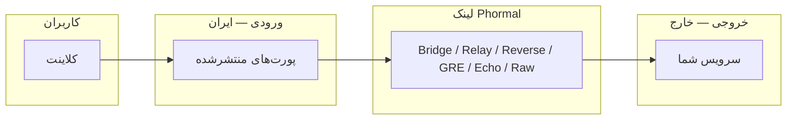

<h1 align="center">🌀 Phormal Tunnel</h1>

<p align="center">
  <em>یک لایه‌ی تونلینگ سریع و مقاوم برای اتصال سرور ورودی و خروجی از میان شبکه‌های فیلترشده.</em>
</p>

<p align="center">
  
  
  
  
</p>

<p align="center">
  <a href="https://github.com/Schmi7zz/Phormal">گیت‌هاب</a> ·
  <a href="https://t.me/SchmitzWS">کانال</a> ·
  <a href="./README.md">🇬🇧 English</a>
</p>

---

<div dir="rtl">

## ✨ Phormal چیست؟

**Phormal** نود **ورودی** (ایران / uplink محدود) را به نود **خروجی** (خارج / uplink تمیز) وصل می‌کند و پورت‌های سرویس را روی **آی‌پی عمومی ایران** منتشر می‌کند — کاربران مستقیماً به خارج وصل نمی‌شوند.

هر مسیر یک‌جور خراب می‌شود: یکی UDP را می‌اندازد، یکی فقط TCP عبور می‌دهد، یکی تقریباً جز ICMP چیزی رد نمی‌کند. به‌جای شرط‌بستن روی یک روش، Phormal **شش محصول تونل مستقل** دارد، هرکدام را روی مسیر واقعی‌ات می‌سنجد و می‌گوید کدام را استفاده کنی.

هر محصول **چندتونله** است: چند نمونه‌ی نام‌دار روی یک سرور، هر کدام با کانفیگ، پورت‌ها و سرویس جدا.

| محصول | مناسب برای |
| ----- | ---------- |
| 🌉 **Phormal Bridge** | مسیر پایدار نقطه‌به‌نقطه — دیفالت مطمئن روی uplink تمیز |
| 🛰️ **Phormal Relay** | بیشترین throughput وقتی مسیر باز است — مبهم‌سازی‌شده با port-hopping |
| 🔁 **Phormal Reverse** | مسیرهایی که فقط **TCP** خروجی رد می‌شود |
| 🪨 **Phormal GRE** | اتصال کم‌سربار و کم‌تأخیر روی مسیرهای دوستانه |
| 📡 **Phormal Echo** | مسیرهای خیلی محدود که تقریباً فقط ترافیک echo رد می‌شود |
| 🧱 **Phormal Raw** | فیلترینگ ضد-UDP — اتصال را طوری شکل می‌دهد که رد شود |

</div>



<div dir="rtl">

---

## 🚀 نصب

روی **هر دو سرور** (ورودی و خروجی) اجرا کن:

</div>

```bash
curl -fsSL https://raw.githubusercontent.com/Schmi7zz/Phormal/main/phormal.sh -o phormal.sh && sed -i 's/\r$//' phormal.sh && chmod +x phormal.sh && sudo ./phormal.sh
```

<div dir="rtl">

بعد از اولین اجرا، Phormal یک دستور سراسری نصب می‌کند:

</div>

```bash
sudo phormal
# یا فقط
phormal
```

<div dir="rtl">

---

## 🧪 Phormal Path Test (منو **۱**)

**همیشه اول** این را برای هر جفت ایران ↔ خارج اجرا کن.

- **همه** محصولات را با ترافیک واقعی دوطرفه روی مسیر واقعی‌ات تست می‌کند.
- به **SSH سرور مقابل** نیاز دارد (کلید ترجیحی؛ پسورد هم کار می‌کند — یک‌بار پرسیده می‌شود).
- فقط یک‌طرفه: این سرور → peer. Phormal هیچ‌وقت از سمت peer به تو SSH باز نمی‌کند.
- جدول **PASS / FAIL** با سطح اطمینان چاپ می‌کند، هر محصول قبول‌شده را به بلوک منویش وصل می‌کند و یک **BEST CHOICE** پیشنهاد می‌دهد.

آی‌پی / پورت / کاربر SSH آخرین peer در `/etc/phormal/phormal.conf` ذخیره می‌شود.

> هر وقت peer جدید اضافه کردی یا رفتار شبکه عوض شد، دوباره بزن — بعد فقط **BEST CHOICE** را دنبال کن.

---

## 🧭 راهنمای منو (نسخه ۵.۶.۰)

### تست مسیر

| # | کار |
| - | --- |
| **۱** | اجرای تست خودکار مسیر (SSH به peer) |

### محصولات

| # | محصول | خروج | ورود | مدیریت |
| - | ----- | ---- | ---- | ------ |
| ۲–۵ | 🌉 **Bridge** | ۲ | ۳ | ۴ (+۵ اسپیدتست) |
| ۶–۹ | 🛰️ **Relay** | ۶ | ۷ | ۸ (+۹ اسپیدتست) |
| ۱۰–۱۲ | 🔁 **Reverse** | ۱۰ | ۱۱ | ۱۲ |
| ۱۳–۱۵ | 🪨 **GRE** | ۱۳ | ۱۴ | ۱۵ |
| ۱۶–۱۸ | 📡 **Echo** | ۱۶ | ۱۷ | ۱۸ |
| ۱۹–۲۱ | 🧱 **Raw** | ۱۹ | ۲۰ | ۲۱ |

> **نقش‌ها:** اول **exit** را روی سرور **خارج** اضافه کن، بعد **entry** را روی سرور **ایران**.

### مدیریت کلی

| # | کار |
| - | --- |
| ۲۲ | Status — همه‌ی تونل‌ها و سلامت سرویس‌ها |
| ۲۳ | Phormal tuning (BBR / fq / cake) |
| ۲۴ | زمان‌بندی auto-refresh |
| ۲۵ | حذف کامل |
| ۰ | خروج |

هر زیرمنوی **مدیریت** نمونه‌ها را لیست می‌کند و امکان ری‌استارت، استاپ، لاگ، ویرایش پورت‌ها، حذف و … می‌دهد.

---

## 🛰️ شروع سریع — Phormal Relay

**خارج — منو ۶**

۱. نام تونل را بگذار، یک **پورت لینک** انتخاب کن (UDP، مثلاً `8531`).
۲. رمزهای auth و مبهم‌سازی را یادداشت کن.
۳. فایروال را باز کن: `ufw allow 8531/udp`
۴. سرویس را روی پورت کاربر اجرا کن (مثلاً `5151`).

**ایران — منو ۷**

۱. آی‌پی خارج، همان پورت لینک و همان رمزها را وارد کن.
۲. **پورت‌های کاربر** برای انتشار را وارد کن.

کاربر → **آی‌پی ایران : پورت کاربر**

---

## 🌉 شروع سریع — Phormal Bridge

لینک Phormal Bridge نقطه‌به‌نقطه است — **برای هر ایران یک لینک خروجی** روی خارج.

- **خارج — منو ۲:** نام، IPها، **bridge key** را یادداشت کن.
- **ایران — منو ۳:** همان key، ترنسپورت، پورت‌های کاربر.

---

## 🗂️ فایل‌ها و سرویس‌ها

| مسیر | کاربرد |
| ---- | ------ |
| `/etc/phormal/bridge/<name>/` | لینک Phormal Bridge |
| `/etc/phormal/relay/<name>/` | تونل Phormal Relay |
| `/etc/phormal/reverse/<name>/` | تونل Phormal Reverse |
| `/etc/phormal/<product>/<name>/` | نمونه‌های GRE، Echo، Raw |
| `/etc/phormal/phormal.conf` | میرور، پیش‌فرض SSH تست |

| الگوی سرویس | محصول |
| ----------- | ----- |
| `phormal-core@<name>` | Phormal Bridge |
| `phormal-relay@<name>` | Phormal Relay |
| `phormal-reverse@<name>` | Phormal Reverse |
| `phormal-gre@<name>` | Phormal GRE |
| `phormal-*@<name>` | Echo / Raw (از Status، منو ۲۲ ببین) |

---

## 🩺 عیب‌یابی

**SSH تست مسیر خطا می‌دهد**

- کلید SSH بگذار یا موقع پرامپت پسورد root سرور مقابل را وارد کن.
- تست دستی: `ssh root@PEER_IP echo OK`

**کاربر Relay timeout می‌گیرد**

- کاربر باید **آی‌پی ایران + پورت کاربر** بزند، نه IP خارج یا پورت لینک.
- اول خارج، بعد ایران را ری‌استارت کن.

**لاگ**

</div>

```bash
# همه‌ی Phormal، زنده
journalctl -u 'phormal-*' -f

# یک محصول خاص
journalctl -u 'phormal-relay@*' -f
journalctl -u 'phormal-core@*' -f
```

<div dir="rtl">

---

## 🔄 به‌روزرسانی

</div>

```bash
curl -fsSL https://raw.githubusercontent.com/Schmi7zz/Phormal/main/phormal.sh -o /usr/local/bin/phormal && sed -i 's/\r$//' /usr/local/bin/phormal && chmod +x /usr/local/bin/phormal && sudo phormal
```

<div dir="rtl">

---

## 🙌 سازندگان

 **کانال:** [@SchmitzWS](https://t.me/SchmitzWS)

## 📄 لایسنس

GPL-3.0 — فایل [LICENSE](LICENSE).

</div>
