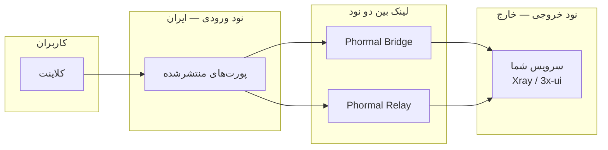

<h1 align="center">🌀 Phormal Tunnel</h1>

<p align="center">
  <em>یک لایه‌ی تونلینگ سریع و مقاوم برای اتصال دو سرور از میان شبکه‌های فیلترشده.</em>
</p>

<p align="center">
  
  
  
  
</p>

<p align="center">
  <a href="https://github.com/Schmi7zz">گیت‌هاب</a> ·
  <a href="https://t.me/SchmitzWS">تلگرام</a> ·
  <a href="./README.md">🇬🇧 English</a>
</p>

---

<div dir="rtl">

## ✨ Phormal چیست؟

**Phormal** یک **نود ورودی** (سرور داخل ایران با اینترنت محدود) را به یک **نود خروجی** (سرور خارج با اینترنت تمیز) وصل می‌کند، سپس پورت‌های سرویس شما را روی نود ورودی منتشر می‌کند تا کاربرها به **آی‌پی عمومی نود ایران** وصل شوند — نه به سرور خارج.

دو حالت دارد:

| حالت | مناسب برای | نحوه‌ی کار |
| ---- | --------- | --------- |
| 🌉 **Phormal Bridge** | مسیرهای پایدار بین دو سرور | لینک خصوصی IPv6 (SIT) + انتشار پورت |
| 🛰️ **Phormal Relay** | مسیرهای پرافت و فیلترشده | تونل QUIC با مبهم‌سازی Salamander |

</div>



<div dir="rtl">

---

## 🆕 تازه‌های نسخه‌ی ۳.۱.۱

- **رله‌ی چندتونله.** هر تونل حالا یک **نمونه‌ی نام‌دار** مستقل است با کانفیگ، پورت، رمز و سرویس systemd مخصوص خودش (`phormal-relay@<name>.service`).
  - یک سرور خارج می‌تواند به **چندین** سرور ایران سرویس بدهد — هر سرور ایران تونل ورودی و پورت‌های خودش را دارد.
  - یک سرور می‌تواند **چند تونل هم‌زمان** داشته باشد (مثلاً ورودی به سه سرور خارج مختلف).
- **مدیریت تک‌به‌تک تونل‌ها.** لیست، ری‌استارت، توقف، شروع، عیب‌یابی، لاگ زنده، ویرایش پورت‌ها، تغییر آی‌پی خارج، تغییر پورت لینک، ویرایش رمزها، ویرایش کانفیگ خام و حذف — **هر کدام مخصوص یک تونل**.
- **رفع باگ «نیاز به ری‌استارت دو طرف».** حالا کلاینت بلافاصله وصل می‌شود و تونل را با keepalive گرم نگه می‌دارد (قبلاً با تأخیر وصل می‌شد و اولین هندشیک معمولاً شکست می‌خورد). `fastOpen` و یک تأخیر کوتاه در بوت هم اضافه شد.

---

## ⚙️ پیش‌نیازها

- **سیستم‌عامل:** لینوکس (ترجیحاً Debian / Ubuntu)
- **دسترسی:** روت (`sudo phormal`)
- **سرورها:** دو سرور — یکی ورودی، یکی خروجی
- **شبکه:** دسترسی UDP بین دو نود (برای پورت لینک رله)

---

## 🚀 نصب

**با یک دستور** — دانلود، اصلاح line ending و اجرا:

</div>

```bash
curl -fsSL https://raw.githubusercontent.com/Schmi7zz/Phormal/main/phormal.sh -o phormal.sh && sed -i 's/\r$//' phormal.sh && chmod +x phormal.sh && sudo ./phormal.sh
```

<div dir="rtl">

بعد از اولین اجرا، از هر جا با این دستور اجرایش کن:

</div>

```bash
sudo phormal
```

<div dir="rtl">

---

## 🛰️ Phormal Relay — پیشنهادی برای ایران ↔ خارج

> یک تونل خروجی (خارج) می‌تواند بین **هر تعداد** تونل ورودی (ایران) به اشتراک گذاشته شود — پورت لینک و رمزها یکی، ولی پورت‌های کاربر برای هر ورودی می‌تواند فرق کند.

### ۱. روی نود خارج — منو **۵** · *Add exit tunnel*

- یک **نام** برای تونل بگذار (مثلاً `kharej-de`)
- یک **پورت لینک** انتخاب کن (UDP، مثلاً `8531`) — نه پورت کاربر
- رمز **auth** و **obfuscation** که نمایش می‌دهد را یادداشت کن
- پورت لینک را در فایروال باز کن: `ufw allow 8531/udp`
- سرویس واقعی (Xray / 3x-ui) را روی پورت کاربر (مثلاً `5151`) بالا بیاور

### ۲. روی هر نود ایران — منو **۶** · *Add entry tunnel*

- یک **نام** بگذار (مثلاً `iran1`)
- **آی‌پی خارج**، **همان پورت لینک** و **همان دو رمز** را وارد کن
- **پورت‌های کاربر** برای انتشار را وارد کن (مثلاً `5151`)

### ۳. کاربر را به نود ایران وصل کن

</div>

```text
  کاربر  →  ایران:5151  →  [ لینک QUIC :8531 ]  →  خارج:5151  →  Xray
```

<div dir="rtl">

| نوع پورت | نمونه | چه کسی وصل می‌شود |
| -------- | ----- | ---------------- |
| 🔗 پورت لینک | `8531` | فقط بین ایران و خارج (UDP) |
| 👤 پورت کاربر | `5151` | کاربرهای VPN شما (از طریق آی‌پی ایران) |

**امکانات رله:** مبهم‌سازی Salamander · کنترل پهنای باند · پورت‌هاپینگ اختیاری · بهینه‌سازی BBR + `fq`.

---

## 🌉 Phormal Bridge — برای مسیرهای پایدار

۱. **نود خارج** → منو **۱** (Quick deploy) یا **۲** (Link only)
۲. **نود ایران** → همان، با **همان bridge key** و آی‌پی‌ها
۳. **نود ایران** → منو **۳** (Port publisher) یا تکمیل Quick deploy برای انتشار پورت‌ها
۴. سرویست را روی **نود خارج** روی پورت‌های منتشرشده اجرا کن
۵. کاربر را به **آی‌پی ایران : پورت منتشرشده** وصل کن

**ترنسپورت‌های انتشار:** `tcp` · `udp` · `grpc`
**پیش‌فرض‌ها:** اینترفیس `phormal0`، MTU برابر `1360`، بهینه‌سازی BBR + `fq`، MSS clamping.

---

## 🧭 راهنمای منو

### 🌉 Phormal Bridge

| # | کار |
| - | --- |
| ۱ | Quick deploy — لینک + انتشار پورت اختیاری |
| ۲ | Link only — تونل SIT بین دو نود |
| ۳ | Port publisher — انتشار پورت‌ها برای کاربر |
| ۴ | Manage — ری‌استارت · بازنویسی · بازسازی · افزودن/حذف پورت · تغییر آدرس · اسپیدتست |

### 🛰️ Phormal Relay (چندتونله)

| # | کار |
| - | --- |
| ۵ | **Add exit tunnel** (این سرور = خارج) |
| ۶ | **Add entry tunnel** (این سرور = ایران) |
| ۷ | **Manage tunnels** — لیست / ویرایش / حذف / ری‌استارت هر تونل |
| ۸ | اسپیدتست |

**Manage tunnels (۷)** همه‌ی تونل‌ها را لیست می‌کند، سپس برای هر تونل:
ری‌استارت · توقف · شروع · عیب‌یابی · لاگ زنده · ویرایش پورت‌ها · تغییر آی‌پی خارج · تغییر پورت لینک · ویرایش رمزها/پهنای‌باند · ویرایش کانفیگ خام · حذف.

### 🛠️ مدیریت کلی

| # | کار |
| - | --- |
| ۹ | Status — وضعیت Bridge و همه‌ی تونل‌های Relay |
| ۱۰ | Phormal tuning — BBR + `fq` (متعادل) یا `cake` (تأخیر کم) |
| ۱۱ | تنظیم MTU برای Bridge (اول `1360`، بعد `1280` اگر آپلود گیر کرد) |
| ۱۲ | زمان‌بندی Auto-refresh — ری‌استارت دوره‌ای با cron |
| ۱۳ | حذف کامل |
| ۰ | خروج |

---

## 🩺 عیب‌یابی

**کاربر وصل نمی‌شود (Relay)**
۱. مطمئن شو کاربر از **آی‌پی ایران + پورت کاربر** استفاده می‌کند، نه آی‌پی خارج یا پورت لینک.
۲. رمزها و پورت لینک روی هر دو نود دقیقاً یکی باشند.
۳. اول **خارج** بعد **ایران** را ری‌استارت کن.
۴. روی هر دو نود **Manage tunnels → انتخاب تونل → Diagnostics** را اجرا کن.
۵. از ایران دسترسی UDP به خارج را تست کن: `nc -zvu EXIT_IP LINK_PORT`

**`connect error: timeout`** — لینک بین دو نود قطع است، نه کانفیگ VPN. مطمئن شو تونل خارج بالاست و پورت UDP لینک باز است.

**`connection refused` روی خارج** — تونل سالم است ولی سرویست روی آن پورت گوش نمی‌دهد. Xray / 3x-ui را روی پورت کاربر بالا بیاور (روی `0.0.0.0` یا `127.0.0.1`).

**`connection reset by peer` در لاگ** — معمولاً طبیعی است (اتصال مجدد کاربرها)؛ اگر ترافیک برقرار است نادیده بگیر.

**Bridge: peer unreachable** — نود مقابل را با همان bridge key بالا بیاور، **۹ Status** را چک کن، در صورت گیر کردن آپلود MTU را از **۱۱** پایین بیاور.

**دیدن لاگ‌ها**

</div>

```bash
journalctl -u 'phormal-relay@*' -f
journalctl -u phormal-core -f
journalctl -u 'phormal-fwd@*' -f
```

<div dir="rtl">

---

## 🔄 به‌روزرسانی

</div>

```bash
curl -fsSL https://raw.githubusercontent.com/Schmi7zz/Phormal/main/phormal.sh -o /usr/local/bin/phormal && sed -i 's/\r$//' /usr/local/bin/phormal && chmod +x /usr/local/bin/phormal && sudo phormal
```

<div dir="rtl">

---

## 🙌 سازندگان

- **نویسنده:** [Schmi7z](https://github.com/Schmi7zz)
- **کانال:** [@SchmitzWS](https://t.me/SchmitzWS)

## 📄 لایسنس

GPL-3.0 — فایل [LICENSE](LICENSE.txt) را ببین.

</div>
