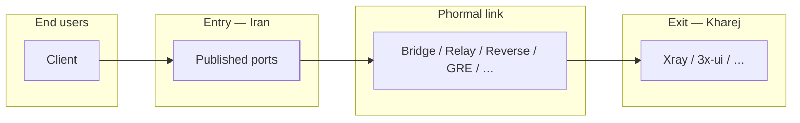

<h1 align="center">🌀 Phormal Tunnel</h1>

<p align="center">
  <em>A fast, resilient tunneling layer for bridging entry and exit servers across hostile networks.</em>
</p>

<p align="center">
  
  
  
  
</p>

<p align="center">
  <a href="https://github.com/Schmi7zz">GitHub</a> ·
  <a href="https://t.me/SchmitzWS">Telegram</a> ·
  <a href="./README.fa.md">🇮🇷 فارسی</a>
</p>

---

## ✨ What is Phormal?

**Phormal** connects an **entry node** (restricted uplink, e.g. Iran) to an **exit node** (clean foreign uplink), then publishes your service ports on the **entry public IP** — users never connect to the exit directly.

Every product is **multi-tunnel**: many named instances per server, each with its own config, ports, and systemd unit.

| Product | Best for | Transport |
| ------- | -------- | --------- |
| 🌉 **Phormal Bridge** | Stable point-to-point paths | SIT (proto-41) + gost publisher |
| 🛰️ **Phormal Relay** | Lossy / filtered UDP paths | Hysteria2 QUIC + Salamander |
| 🔁 **Phormal Reverse** | TCP reverse connectivity | rathole |
| 🪨 **Phormal GRE** | When SIT is blocked | Kernel GRE / IPIP |
| 📡 **Phormal Echo** | ICMP-friendly paths | icmp_tun |
| 🧱 **Phormal Raw** | UDP with faketcp disguise | udp2raw |
| 🌊 **Phormal Stream** | Reliable TCP tunnel | Backhaul TCP |
| 🥷 **Phormal Cloak** | TLS / WebSocket lookalike | Backhaul WSS |
| 🌐 **Phormal DNS** | DNS-only egress | iodine |
| ⚡ **Phormal Edge** | Lightweight TCP forward | proxyforwarder |



---

## 🚀 Install

```bash
curl -fsSL https://raw.githubusercontent.com/Schmi7zz/Phormal/main/phormal.sh -o phormal.sh && sed -i 's/\r$//' phormal.sh && chmod +x phormal.sh && sudo ./phormal.sh
```

After the first run:

```bash
sudo phormal
```

### Mirror (Iran — fast binary downloads)

On your mirror host:

```bash
sudo bash mirror-host-setup.sh
```

Clients use `MIRROR_BASE=http://YOUR_MIRROR:8880/phormal` in `/etc/phormal/phormal.conf` (seeded automatically on first run).

---

## 🧪 Phormal Path Test (menu **1**)

**Always run this first** when pairing a new Iran ↔ Kharej servers.

- Tests **every** product with real bidirectional traffic (kernel tunnels, UDP, TCP, ICMP, TLS, DNS).
- Needs **SSH access to the peer** (key preferred; password works — prompted once per test).
- Prints a PASS/FAIL table and tells you **which menu block** to use next.

Peer SSH host/port/user are remembered in `/etc/phormal/phormal.conf`.

---

## 🧭 Menu reference (v5.4.0)

### Path test

| # | Action |
| - | ------ |
| **1** | Run path auto-test (SSH to peer) |

### Core products

| # | Product | Exit | Entry | Manage |
| - | ------- | ---- | ----- | ------ |
| 2–5 | **Bridge** | 2 | 3 | 4 (+5 speedtest) |
| 6–9 | **Relay** | 6 | 7 | 8 (+9 speedtest) |
| 10–12 | **Reverse** | 10 | 11 | 12 |

### Extended products

| # | Product | Exit | Entry | Manage |
| - | ------- | ---- | ----- | ------ |
| 13–15 | **GRE** | 13 | 14 | 15 |
| 16–18 | **Echo** | 16 | 17 | 18 |
| 19–21 | **Raw** | 19 | 20 | 21 |
| 22–24 | **Stream** | 22 | 23 | 24 |
| 25–27 | **Cloak** | 25 | 26 | 27 |
| 28–30 | **DNS** | 28 | 29 | 30 |
| 31–33 | **Edge** | 31 | 32 | 33 |

### Manage

| # | Action |
| - | ------ |
| 34 | Status — all tunnels |
| 35 | Phormal tuning (BBR / fq / cake) |
| 36 | Auto-refresh schedule (cron) |
| 37 | Uninstall |
| 0 | Exit |

Each **Manage** submenu lists instances and offers restart, stop, logs, edit ports, delete, etc.

---

## 🛰️ Quick start — Phormal Relay

**Exit (Kharej) — menu 6**

1. Name the tunnel, pick a **link port** (UDP, e.g. `8531`).
2. Note auth + obfuscation passwords.
3. Open firewall: `ufw allow 8531/udp`
4. Run your service on the user port (e.g. `5151`).

**Entry (Iran) — menu 7**

1. Enter exit IP, same link port, same passwords.
2. Enter **user ports** to publish.

Users connect to **Iran IP : user port**.

---

## 🌉 Quick start — Phormal Bridge

SIT is point-to-point: **one exit link per Iran peer**.

- **Exit — menu 2:** name, IPs, note the **bridge key**.
- **Entry — menu 3:** matching key, transport, user ports.

---

## 🗂️ Files & services

| Path | Purpose |
| ---- | ------- |
| `/etc/phormal/bridge/<name>/meta.conf` | Bridge link metadata |
| `/etc/phormal/relay/<name>/config.yaml` | Hysteria config |
| `/etc/phormal/reverse/<name>/` | Reverse tunnel |
| `/etc/phormal/<product>/<name>/` | GRE, Echo, Raw, Stream, … |
| `/etc/phormal/phormal.conf` | Mirror URL, path-test SSH defaults |

| Service pattern | Product |
| --------------- | ------- |
| `phormal-core@<name>` | Bridge SIT |
| `phormal-relay@<name>` | Relay |
| `phormal-reverse@<name>` | Reverse |
| `phormal-gre@<name>` | GRE |
| `phormal-icmp@<name>` | Echo |
| `phormal-udp2raw@<name>` | Raw |
| `phormal-btcp@<name>` | Stream |
| `phormal-bwss@<name>` | Cloak |
| `phormal-dns@<name>` | DNS |
| `phormal-fwd@<name>` | Edge |

---

## 🩺 Troubleshooting

**Path test SSH fails**

- Ensure key auth **or** be ready to type the peer root password when prompted.
- Test manually: `ssh root@PEER_IP echo OK`

**Relay clients timeout**

- Users must use **entry IP + user port**, not exit IP or link port.
- Restart exit first, then entry.

**View logs**

```bash
journalctl -u 'phormal-relay@*' -f
journalctl -u 'phormal-core@*' -f
journalctl -u 'phormal-btcp@*' -f
```

---

## 🔄 Updating

```bash
curl -fsSL https://raw.githubusercontent.com/Schmi7zz/Phormal/main/phormal.sh -o /usr/local/bin/phormal && sed -i 's/\r$//' /usr/local/bin/phormal && chmod +x /usr/local/bin/phormal && sudo phormal
```

See also [MULTILAYER.md](./MULTILAYER.md) for extended products and path-test details.

---

## 🙌 Credits

- **Author:** [Schmi7z](https://github.com/Schmi7zz)
- **Channel:** [@SchmitzWS](https://t.me/SchmitzWS)

## 📄 License

GPL-3.0 — see [LICENSE](LICENSE.txt).
