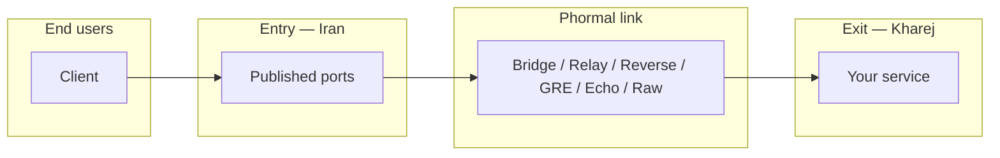

<h1 align="center">🌀 Phormal Tunnel</h1>

<p align="center">
  <em>A fast, resilient tunneling layer for bridging entry and exit servers across hostile networks.</em>
</p>

<p align="center">
  
  
  
  
</p>

<p align="center">
  <a href="https://github.com/Schmi7zz/Phormal">GitHub</a> ·
  <a href="https://t.me/SchmitzWS">Channel</a> ·
  <a href="./README.fa.md">🇮🇷 فارسی</a>
</p>

---

## ✨ What is Phormal?

**Phormal** connects an **entry node** (restricted uplink, e.g. Iran) to an **exit node** (clean foreign uplink), then publishes your service ports on the **entry public IP** — users never connect to the exit directly.

Every path breaks differently: some drop UDP, some pass only TCP, some barely let anything through but ICMP. Instead of betting on one method, Phormal ships **six independent tunnel products**, tests each one against your real path, and tells you which to use.

Every product is **multi-tunnel**: many named instances per server, each with its own config, ports, and service unit.

| Product | Best for |
| ------- | -------- |
| 🌉 **Phormal Bridge** | Stable point-to-point paths — your solid default on clean uplinks |
| 🛰️ **Phormal Relay** | Maximum throughput when the path is open — obfuscated, with port-hopping |
| 🔁 **Phormal Reverse** | Paths where only outbound **TCP** survives |
| 🪨 **Phormal GRE** | Low-overhead, low-latency links on friendly paths |
| 📡 **Phormal Echo** | Heavily restricted paths where little more than echo traffic passes |
| 🧱 **Phormal Raw** | UDP-hostile filtering — shapes the link to slip past |



---

## 🚀 Install

Run on **both** servers (entry and exit):

```bash
curl -fsSL https://raw.githubusercontent.com/Schmi7zz/Phormal/main/phormal.sh -o phormal.sh && sed -i 's/\r$//' phormal.sh && chmod +x phormal.sh && sudo ./phormal.sh
```

After the first run, Phormal installs a global command:

```bash
sudo phormal
# or simply
phormal
```

## 🧪 Phormal Path Test (menu **1**)

**Always run this first** when pairing a new Iran ↔ Kharej set.

- Tests **every** product with real bidirectional traffic across your actual path.
- Needs **SSH access to the peer** (key preferred; password also works — prompted once).
- One direction only: this host → peer. Phormal never opens SSH back from the peer.
- Prints a **PASS / FAIL** table with a confidence rating, maps each passing product to its menu block, and recommends a **BEST CHOICE**.

Peer SSH host / port / user are remembered in `/etc/phormal/phormal.conf`.

> Re-run it whenever you add a new peer or the network behavior changes — then just follow the **BEST CHOICE**.

---

## 🧭 Menu reference (v6.3.3)

### Path test

| # | Action |
| - | ------ |
| **1** | Run path auto-test (SSH to peer) |

### Products

| # | Product | Exit | Entry | Manage |
| - | ------- | ---- | ----- | ------ |
| 2–5 | 🌉 **Bridge** | 2 | 3 | 4 (+5 speedtest) |
| 6–9 | 🛰️ **Relay** | 6 | 7 | 8 (+9 speedtest) |
| 10–12 | 🔁 **Reverse** | 10 | 11 | 12 |
| 13–15 | 🪨 **GRE** | 13 | 14 | 15 |
| 16–18 | 📡 **Echo** | 16 | 17 | 18 |
| 19–21 | 🧱 **Raw** | 19 | 20 | 21 |

> **Roles:** add the **exit** on the **Kharej** server first, then the **entry** on the **Iran** server.

### Manage

| # | Action |
| - | ------ |
| 22 | Status — all tunnels & service health |
| 23 | Phormal tuning (BBR / fq / cake) |
| 24 | Auto-refresh schedule |
| 25 | Uninstall |
| 0 | Exit |

Each **Manage** submenu lists instances and offers restart, stop, logs, edit ports, delete, etc.

---

## 🛰️ Quick start — Phormal Relay

**Exit (Kharej) — menu 6**

1. Name the tunnel, pick a **link port** (UDP, e.g. `8531`).
2. Note the auth + obfuscation passwords.
3. Open the firewall: `ufw allow 8531/udp`
4. Run your service on the user port (e.g. `5151`).

**Entry (Iran) — menu 7**

1. Enter the exit IP, the same link port, the same passwords.
2. Enter the **user ports** to publish.

Users connect to **Iran IP : user port**.

---

## 🌉 Quick start — Phormal Bridge

A Phormal Bridge link is point-to-point: **one exit link per Iran peer**.

- **Exit — menu 2:** name, IPs, note the **bridge key**.
- **Entry — menu 3:** matching key, transport, user ports.

---

## 🗂️ Files & services

| Path | Purpose |
| ---- | ------- |
| `/etc/phormal/bridge/<name>/` | Phormal Bridge link |
| `/etc/phormal/relay/<name>/` | Phormal Relay tunnel |
| `/etc/phormal/reverse/<name>/` | Phormal Reverse tunnel |
| `/etc/phormal/<product>/<name>/` | GRE, Echo, Raw instances |
| `/etc/phormal/phormal.conf` | Mirror URL, path-test SSH defaults |

| Service pattern | Product |
| --------------- | ------- |
| `phormal-core@<name>` | Phormal Bridge |
| `phormal-relay@<name>` | Phormal Relay |
| `phormal-reverse@<name>` | Phormal Reverse |
| `phormal-gre@<name>` | Phormal GRE |
| `phormal-*@<name>` | Echo / Raw (see Status, menu 22) |

---

## 🩺 Troubleshooting

**Path test SSH fails**

- Use key auth, or be ready to type the peer root password when prompted.
- Test manually: `ssh root@PEER_IP echo OK`

**Relay clients time out**

- Users must use the **entry IP + user port**, not the exit IP or link port.
- Restart the exit first, then the entry.

**View logs**

```bash
# everything Phormal, live
journalctl -u 'phormal-*' -f

# a single product
journalctl -u 'phormal-relay@*' -f
journalctl -u 'phormal-core@*' -f
```

---

## 🔄 Updating

```bash
curl -fsSL https://raw.githubusercontent.com/Schmi7zz/Phormal/main/phormal.sh -o /usr/local/bin/phormal && sed -i 's/\r$//' /usr/local/bin/phormal && chmod +x /usr/local/bin/phormal && sudo phormal
```

---

## 🙌 Credits


- **Channel:** [@SchmitzWS](https://t.me/SchmitzWS)


## 📄 License

GPL-3.0 — see [LICENSE](LICENSE).
