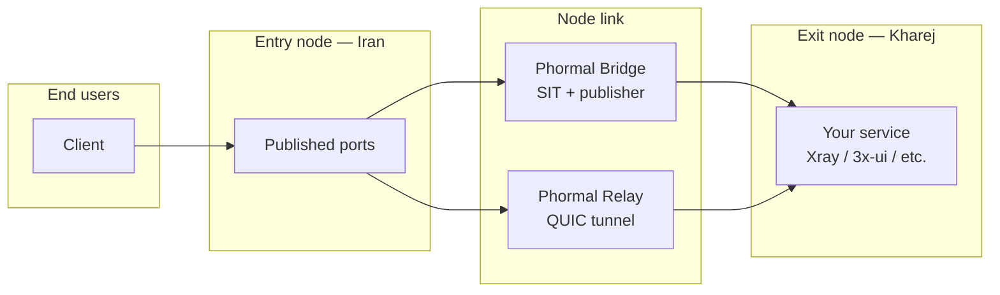

<h1 align="center">🌀 Phormal Tunnel</h1>

<p align="center">
  <em>A fast, resilient tunneling layer for bridging two servers across hostile networks.</em>
</p>

<p align="center">
  
  
  
  
</p>

<p align="center">
  <a href="https://github.com/Schmi7zz">GitHub</a> ·
  <a href="https://t.me/SchmitzWS">Telegram</a> ·
  <a href="./README.fa.md">🇮🇷 فارسی</a>
</p>

---

## ✨ What is Phormal?

**Phormal** connects an **entry node** (restricted / local uplink) to an **exit node** (clean foreign uplink), then publishes your service ports so end users connect to the **entry node's public IP** — never the exit.

Two modes are built in:

| Mode | Best for | How it works |
| ---- | -------- | ------------ |
| 🌉 **Phormal Bridge** | Stable paths between nodes | Private SIT IPv6 link + port publisher |
| 🛰️ **Phormal Relay** | Lossy, filtered, or congested paths | QUIC tunnel with Salamander obfuscation |



---

## 🆕 What's new in 3.1.1

- **Multi-tunnel Relay.** Every tunnel is now a **named instance** with its own config, ports, credentials, and systemd service (`phormal-relay@<name>.service`).
  - One Kharej can serve **many** Iran nodes — each Iran box runs its own entry tunnel with its own ports.
  - One box can host **several tunnels at once** (e.g. entry to three different exits).
- **Per-tunnel management.** List, restart, stop, start, diagnose, tail live logs, edit ports, change exit IP, change link port, edit credentials, edit raw config, or delete — **each scoped to one tunnel**.
- **No more "restart on both sides" bug.** The client now connects eagerly and keeps the tunnel warm with keepalive (previously it started lazily and the first handshake often failed). Added `fastOpen` and a short start delay for reliable boot ordering.

---

## ⚙️ Requirements

- **OS:** Linux (Debian / Ubuntu recommended)
- **Access:** root (`sudo phormal`)
- **Nodes:** two servers — one entry, one exit
- **Network:** UDP reachability between nodes (for the Relay link port)

---

## 🚀 Install

**One command** — download, normalise line endings, and launch:

```bash
curl -fsSL https://raw.githubusercontent.com/Schmi7zz/Phormal/main/phormal.sh -o phormal.sh && sed -i 's/\r$//' phormal.sh && chmod +x phormal.sh && sudo ./phormal.sh
```

After the first run, use the global command anywhere:

```bash
sudo phormal
```

---

## 🛰️ Phormal Relay — recommended for Iran ↔ foreign VPS

> One exit (Kharej) tunnel can be shared by **any number** of entry (Iran) tunnels — same link port, same passwords, different user ports per entry.

### 1. On the exit (Kharej) — menu **5** · *Add exit tunnel*

- Give the tunnel a **name** (e.g. `kharej-de`)
- Choose a **link port** (UDP, e.g. `8531`) — *not* a user port
- Note the **auth** and **obfuscation** passwords it prints
- Open the link port in the firewall: `ufw allow 8531/udp`
- Run your real service (Xray / 3x-ui) locally on the user port (e.g. `5151`)

### 2. On each entry (Iran) — menu **6** · *Add entry tunnel*

- Give it a **name** (e.g. `iran1`)
- Enter the **exit IP**, the **same link port**, and the **same two passwords**
- Enter the **user ports** to publish (e.g. `5151`)

### 3. Point users at the entry

```text
  Client  →  Entry:5151  →  [ QUIC link :8531 ]  →  Exit:5151  →  Xray
```

| Port type | Example | Who connects |
| --------- | ------- | ------------ |
| 🔗 Link port | `8531` | Entry ↔ Exit only (UDP) |
| 👤 User port | `5151` | Your VPN clients (via **entry IP**) |

**Relay features:** Salamander obfuscation · bandwidth shaping · optional UDP port hopping · BBR + `fq` tuning.

---

## 🌉 Phormal Bridge — for stable paths

1. **Exit node** → menu **1** (Quick deploy) or **2** (Link only)
2. **Entry node** → same, using the **same bridge key** and peer addresses
3. **Entry node** → menu **3** (Port publisher) or finish Quick deploy to publish ports
4. Run your service on the **exit** on the ports you publish
5. Point users at **entry IP : published port**

**Publisher transports:** `tcp` · `udp` · `grpc`
**Defaults:** SIT interface `phormal0`, MTU `1360`, BBR + `fq` tuning, MSS clamping.

---

## 🧭 Menu reference

### 🌉 Phormal Bridge

| # | Action |
| - | ------ |
| 1 | Quick deploy — link + optional port publisher |
| 2 | Link only — SIT tunnel between nodes |
| 3 | Port publisher only — expose ports to users |
| 4 | Manage — restart · rewrite · rebuild · add/remove ports · change addresses · speedtest |

### 🛰️ Phormal Relay (multi-tunnel)

| # | Action |
| - | ------ |
| 5 | **Add exit tunnel** (this server = Kharej) |
| 6 | **Add entry tunnel** (this server = Iran) |
| 7 | **Manage tunnels** — list / edit / delete / restart each |
| 8 | Speedtest |

**Manage tunnels (7)** lists every tunnel, then per tunnel offers:
restart · stop · start · diagnostics · live log · edit ports · change exit IP · change link port · edit auth/obfs/bandwidth · edit raw config · delete.

### 🛠️ Global

| # | Action |
| - | ------ |
| 9 | Status — Bridge link, forwarders, and all Relay tunnels |
| 10 | Phormal tuning — BBR + `fq` (balanced) or `cake` (low-latency) |
| 11 | Adjust Bridge MTU — live + persistent (try `1360`, then `1280` if uploads stall) |
| 12 | Auto-refresh schedule — periodic service restart via cron |
| 13 | Uninstall |
| 0 | Exit |

---

## 📊 Speedtest

Two steps, run on **both** nodes within ~30 seconds of each other.

**Relay:** Exit → menu **8** → step **1** (listener), then Entry → menu **8** → step **2** (test, pick the tunnel).
**Bridge:** Exit → Bridge Manage → **7** → step **1**, then Entry → step **2**.

---

## 🗂️ Files & services

| Path | Purpose |
| ---- | ------- |
| `/etc/phormal/phormal.conf` | Bridge settings |
| `/etc/phormal/core-up.sh` | Bridge SIT bring-up script |
| `/etc/phormal/relay/<name>/meta.conf` | Per-tunnel settings (role, IP, ports, credentials) |
| `/etc/phormal/relay/<name>/config.yaml` | Per-tunnel engine config |
| `/etc/phormal/tls/` | Shared self-signed certificate |
| `/var/log/phormal.log` | Phormal log file |

| Service | Mode |
| ------- | ---- |
| `phormal-core.service` | Bridge SIT link |
| `phormal-guard.service` | Bridge keepalive |
| `phormal-fwd@*.service` | Bridge port publishers |
| `phormal-relay@<name>.service` | One Relay tunnel each |

---

## 🩺 Troubleshooting

**Clients can't connect (Relay)**
1. Confirm users use **entry IP + user port** — not the exit IP or link port.
2. Check both passwords and the link port match on entry and exit.
3. Restart the **exit first**, then the **entry**.
4. Run **Manage tunnels → pick tunnel → Diagnostics** on both nodes.
5. From the entry, test UDP to the exit: `nc -zvu EXIT_IP LINK_PORT`

**`connect error: timeout`** — the node link is down, not your VPN config. Make sure the exit tunnel is running and the link UDP port is open.

**`connection refused` on the exit** — the tunnel works, but your service isn't listening on that port. Start Xray / 3x-ui on the user port (bind to `0.0.0.0` or `127.0.0.1`).

**`connection reset by peer` in logs** — usually normal as clients reconnect; ignore if traffic flows.

**Bridge: peer unreachable** — bring up the other node with the same bridge key, check **9 Status**, lower MTU via **11** if uploads stall.

**View logs**
```bash
journalctl -u 'phormal-relay@*' -f
journalctl -u phormal-core -f
journalctl -u 'phormal-fwd@*' -f
```

---

## 🔄 Updating

```bash
curl -fsSL https://raw.githubusercontent.com/Schmi7zz/Phormal/main/phormal.sh -o /usr/local/bin/phormal && sed -i 's/\r$//' /usr/local/bin/phormal && chmod +x /usr/local/bin/phormal && sudo phormal
```

---

## 🙌 Credits

- **Author:** [Schmi7z](https://github.com/Schmi7zz)
- **Channel:** [@SchmitzWS](https://t.me/SchmitzWS)

## 📄 License

GPL-3.0 — see [LICENSE](LICENSE.txt).
