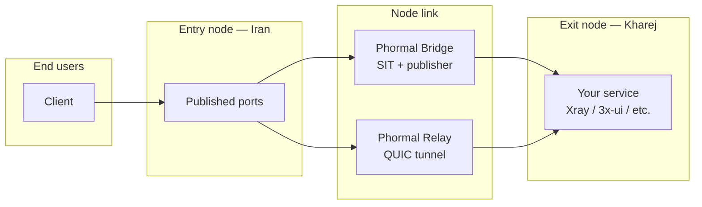

<h1 align="center">Phormal Tunnel</h1>

<p align="center">
  <em>A fast, resilient tunneling layer for bridging two servers across hostile networks.</em>
</p>

<p align="center">
  
  
  
  
</p>

<p align="center">
  <a href="https://github.com/Schmi7zz">GitHub</a> ·
  <a href="https://t.me/SchmitzWS">Telegram</a>
</p>

---

## Overview

**Phormal** connects an **entry node** (restricted / local uplink) to an **exit node** (clean foreign uplink), then publishes your service ports so end users connect to the **entry node's public IP** — not the exit.

Two modes are built in:

| Mode | Best for | How it works |
| ---- | -------- | ------------ |
| **Phormal Bridge** | Stable paths between nodes | Private SIT IPv6 link + port publisher |
| **Phormal Relay** | Lossy, filtered, or congested paths | QUIC-based relay with obfuscation |



---

## Requirements

- **OS:** Linux (Debian/Ubuntu recommended)
- **Access:** root (`sudo phormal`)
- **Nodes:** two servers — one entry, one exit
- **Network:** UDP reachability between nodes (for Relay link port)

---

## Install

```bash
curl -fsSL -o phormal.sh https://raw.githubusercontent.com/Schmi7zz/Phormal/main/phormal.sh
chmod +x phormal.sh
sudo ./phormal.sh
```

After the first run, use the global command:

```bash
sudo phormal
```

---

## Choose a mode

### Phormal Bridge

Use when the path between your servers is **relatively stable** and you want a lightweight private link.

1. **Exit node** → menu **1** (Quick deploy) or **2** (Link only)
2. **Entry node** → same, using the **same bridge key** and peer addresses
3. **Entry node** → menu **3** (Port publisher) or finish Quick deploy to publish ports
4. Run your service on the **exit** on the ports you publish
5. Point users at **entry IP : published port**

**Publisher transports:** `tcp` · `udp` · `grpc`

**Defaults:** SIT interface `phormal0`, MTU `1360`, BBR + `fq` tuning, MSS clamping.

---

### Phormal Relay

Use when the path is **lossy, filtered, or unreliable** (typical Iran ↔ foreign VPS setups).

1. **Exit node (Kharej)** → menu **6** (Exit node only) or **5** (Quick deploy)
   - Sets the **link port** (UDP, e.g. `8531`) — not your user port
   - Run your service locally on the **user port** (e.g. `5151`)
2. **Entry node (Iran)** → menu **7** (Entry node only) or **5** (Quick deploy)
   - Enter exit IP, **same link port**, **same auth + obfuscation passwords**
   - Enter **user ports** to publish (e.g. `5151`)
3. Point users at **entry IP : user port** — never the exit IP for clients

```text
  Client  →  Entry:5151  →  [QUIC link :8531]  →  Exit:5151  →  Xray
```

| Port type | Example | Who connects |
| --------- | ------- | ------------ |
| Link port | `8531` | Entry ↔ Exit only (UDP) |
| User port | `5151` | Your VPN clients |

**Relay features:** Salamander obfuscation, bandwidth shaping, optional UDP port hopping, BBR/fq tuning.

---

## Menu reference

### Phormal Bridge

| # | Action |
| - | ------ |
| 1 | Quick deploy — link + optional port publisher |
| 2 | Link only — SIT tunnel between nodes |
| 3 | Port publisher only — expose ports to users |
| 4 | Manage |

**Manage (4):** restart · rewrite config · rebuild link · add/remove ports · change addresses · speedtest

### Phormal Relay

| # | Action |
| - | ------ |
| 5 | Quick deploy — pick exit or entry role |
| 6 | Exit node only |
| 7 | Entry node only |
| 8 | Manage |

**Manage (8):** restart · rewrite config · reapply settings · add/remove ports · change exit IP · diagnostics · speedtest

### Global manage

| # | Action |
| - | ------ |
| 9 | Status — Bridge link, forwarders, Relay service |
| 10 | Phormal tuning — BBR + `fq` (balanced) or `cake` (low-latency) |
| 11 | Adjust Bridge MTU — live + persistent (try `1360`, then `1280` if uploads stall) |
| 12 | Auto-refresh schedule — periodic service restart via cron |
| 13 | Uninstall |
| 0 | Exit |

---

## Speedtest

### Bridge

Two steps — run on **both** nodes:

1. **Exit** → Bridge Manage → **7 Speedtest** → step **1** (starts listener)
2. **Entry** → Bridge Manage → **7 Speedtest** → step **2** (runs test)

Complete step 2 within ~30 seconds of step 1.

### Relay

Two steps — run on **both** nodes:

1. **Exit (Kharej)** → Relay Manage → **8 Speedtest** → step **1** (starts listener)
2. **Entry (Iran)** → Relay Manage → **8 Speedtest** → step **2** (runs test)

Complete step 2 within ~30 seconds of step 1. Both nodes must keep `phormal-relay` running.

---

## Configuration files

| Path | Purpose |
| ---- | ------- |
| `/etc/phormal/phormal.conf` | Main settings (role, IPs, ports, credentials) |
| `/etc/phormal/core-up.sh` | Bridge SIT bring-up script |
| `/etc/phormal/relay/config.yaml` | Relay engine config |
| `/var/log/phormal.log` | Phormal log file |

**Services**

| Service | Mode |
| ------- | ---- |
| `phormal-core.service` | Bridge SIT link |
| `phormal-guard.service` | Bridge keepalive |
| `phormal-fwd@*.service` | Bridge port publishers |
| `phormal-relay.service` | Relay (client or server) |

---

## Typical Relay deployment

| | Entry (Iran) | Exit (Kharej) |
| --- | --- | --- |
| Role | `entry` | `exit` |
| Link port | connects to `:8531` | listens UDP `:8531` |
| User port | publishes `5151` | Xray on TCP `:5151` |
| Client connects to | **Entry public IP :5151** | — |

Credentials (auth + obfuscation) and link port **must match exactly** on both nodes.

---

## Troubleshooting

### Relay: clients cannot connect

1. Confirm users use **entry IP + user port**, not exit IP or link port
2. Check both passwords and link port match on entry and exit
3. Restart **exit first**, then **entry:** `systemctl restart phormal-relay`
4. Run **Relay Manage → 7 Diagnostics** on both nodes
5. From entry, verify UDP to exit link port: `nc -zvu EXIT_IP LINK_PORT`

### Relay: `connect error: timeout`

The **node link** is down, not your VPN config. Restart both relay services and watch exit logs for activity from the entry IP.

### Relay: `connection reset by peer` in logs

Usually **normal** when VPN clients reconnect or open many parallel connections. Ignore if service works.

### Bridge: peer unreachable

Bring up the other node with the same bridge key, then check **9 Status**. Lower MTU via **11** if uploads stall.

### View logs

```bash
journalctl -u phormal-relay -f
journalctl -u phormal-core -f
journalctl -u 'phormal-fwd@*' -f
```

---

## Updating

```bash
curl -fsSL -o /usr/local/bin/phormal https://raw.githubusercontent.com/Schmi7zz/Phormal/main/phormal.sh
chmod +x /usr/local/bin/phormal
sudo phormal
```

After updating, use **Rewrite config** or **Reapply settings** in the relevant Manage menu if prompted.

---

## Credits

- **Author:** [Schmi7z](https://github.com/Schmi7zz)
- **Channel:** [@SchmitzWS](https://t.me/SchmitzWS)

## License

GPL-3.0 — see [LICENSE](LICENSE).
