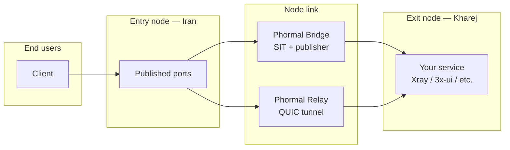

<h1 align="center">🌀 Phormal Tunnel</h1>

<p align="center">
  <em>A fast, resilient tunneling layer for bridging two servers across hostile networks.</em>
</p>

<p align="center">
  
  
  
  
</p>

<p align="center">
  <a href="https://github.com/Schmi7zz">GitHub</a> ·
  <a href="https://t.me/SchmitzWS">Telegram</a> ·
  <a href="./README.fa.md">🇮🇷 فارسی</a>
</p>

---

## ✨ What is Phormal?

**Phormal** connects an **entry node** (restricted / local uplink) to an **exit node** (clean foreign uplink), then publishes your service ports so end users connect to the **entry node's public IP** — never the exit.

Two modes, both **multi-tunnel** — one box can run many independent links/tunnels at once:

| Mode | Best for | How it works |
| ---- | -------- | ------------ |
| 🌉 **Phormal Bridge** | Stable paths between nodes | Private SIT IPv6 link + port publisher |
| 🛰️ **Phormal Relay** | Lossy, filtered, or congested paths | QUIC tunnel with Salamander obfuscation |



---

## 🆕 What's new

- **Multi-tunnel everywhere.** Both **Bridge** and **Relay** are now built around **named instances**, each with its own config, ports, credentials, and systemd service.
  - **One Kharej → many Iran.** A single exit server can serve any number of Iran nodes. For Relay it's one shared exit tunnel; for Bridge you add one exit *link* per Iran peer (SIT is point-to-point).
  - One box can host **several tunnels at once** (e.g. entry to three different exits).
- **Per-instance management.** List, restart, stop, start, diagnose, tail logs, edit ports, change peer/exit IP, change link port or bridge key, edit MTU, edit raw config, or delete — **each scoped to one tunnel**.
- **No more "restart both sides" bug (Relay).** The client now connects eagerly and keeps the tunnel warm with keepalive, instead of starting lazily and failing the first handshake. Added `fastOpen` and a short boot delay.
- **Robust menu.** A failing action no longer aborts the whole tool — it just reports and returns to the menu.
- **Choose your binary source (3.4.0).** When gost/hysteria need installing, pick once per run: **Mirror** (fast inside Iran), **GitHub** (official pinned releases), or **Manual** (drop the files in `/root/phormal/` yourself). Manual mode tells you the exact filename and official download URL if a file is missing.
- **CDN / WebSocket front (3.4.0).** When creating a Relay **entry** tunnel you can optionally put it behind a CDN (e.g. ArvanCloud) on port 80 + WebSocket: the script runs a lightweight gost front (the same engine, no nginx) that forwards port 80 to the local tunnel port; the WebSocket is terminated on the exit’s Xray. If the CDN later blocks WebSocket, point clients straight at the server IP:port — the tunnel keeps working.

---

## ⚙️ Requirements

- **OS:** Linux (Debian / Ubuntu recommended)
- **Access:** root (`sudo phormal`)
- **Nodes:** two or more servers — entries and exits
- **Network:** UDP reachability between nodes (for the Relay link port)

---

## 🚀 Install

**One command** — download, normalise line endings, and launch:

```bash
curl -fsSL https://raw.githubusercontent.com/Schmi7zz/Phormal/main/phormal.sh -o phormal.sh && sed -i 's/\r$//' phormal.sh && chmod +x phormal.sh && sudo ./phormal.sh
```

After the first run, use the global command anywhere:

```bash
sudo phormal
```

---

## 🛰️ Phormal Relay — recommended for Iran ↔ foreign VPS

> One exit (Kharej) tunnel can be shared by **any number** of entry (Iran) tunnels — same link port, same passwords, different user ports per entry.

**1. On the exit (Kharej) — menu `5` · Add exit tunnel**
- Name the tunnel (e.g. `kharej-de`), pick a **link port** (UDP, e.g. `8531`)
- Note the **auth** + **obfuscation** passwords it prints
- Open it in the firewall: `ufw allow 8531/udp`
- Run your real service (Xray / 3x-ui) locally on the user port (e.g. `5151`)

**2. On each entry (Iran) — menu `6` · Add entry tunnel**
- Name it (e.g. `iran1`), enter the **exit IP**, the **same link port**, and the **same two passwords**
- Enter the **user ports** to publish (e.g. `5151`)

**3. Point users at the entry**

```text
  Client  →  Entry:5151  →  [ QUIC link :8531 ]  →  Exit:5151  →  Xray
```

| Port type | Example | Who connects |
| --------- | ------- | ------------ |
| 🔗 Link port | `8531` | Entry ↔ Exit only (UDP) |
| 👤 User port | `5151` | Your VPN clients (via **entry IP**) |

**Relay features:** Salamander obfuscation · bandwidth shaping · optional UDP port hopping · BBR + `fq` tuning.

---

## 🌉 Phormal Bridge — multi-tunnel, for stable paths

A SIT tunnel is point-to-point, so **one Kharej serves N Iran nodes by adding one exit link per peer** — each with its own bridge key.

**1. On the exit (Kharej) — menu `1` · Add exit link** *(repeat per Iran node)*
- Name it (e.g. `iran1`), enter this exit's IP and the Iran peer's IP
- Note the **bridge key** it prints
- Run your service locally on the ports you'll publish

**2. On each entry (Iran) — menu `2` · Add entry link**
- Name it, enter this node's IP and the exit IP
- Enter the **same bridge key** as the matching exit link
- Choose transport (`tcp` / `udp` / `grpc`) and the **user ports** to publish

**3. Point users at `entry IP : published port`.**

**Defaults:** per-link interface `phm-<name>`, MTU `1360`, BBR + `fq` tuning, MSS clamping.

---

## 🧭 Menu reference

### 🌉 Phormal Bridge (multi-tunnel)

| # | Action |
| - | ------ |
| 1 | Add exit link (this server = Kharej) — one per Iran peer |
| 2 | Add entry link (this server = Iran) |
| 3 | Manage links — list / edit / delete / restart each |
| 4 | Speedtest |

### 🛰️ Phormal Relay (multi-tunnel)

| # | Action |
| - | ------ |
| 5 | Add exit tunnel (this server = Kharej) |
| 6 | Add entry tunnel (this server = Iran) |
| 7 | Manage tunnels — list / edit / delete / restart each |
| 8 | Speedtest |

**Manage** (links or tunnels) lists every instance, then per instance offers:
restart · stop · start · diagnostics / ping · live log · edit ports · change peer/exit IP · change link port or bridge key · change MTU · edit raw config · delete.

### 🛠️ Global

| # | Action |
| - | ------ |
| 9 | Status — all bridge links and relay tunnels |
| 10 | Phormal tuning — BBR + `fq` (balanced) or `cake` (low-latency) |
| 11 | Auto-refresh schedule — periodic service restart via cron |
| 12 | Uninstall |
| 0 | Exit |

> MTU is now adjusted **per link** inside Manage → Change MTU (try `1360`, then `1280` if uploads stall).

---

## 📊 Speedtest

Two steps, run on **both** nodes within ~30 seconds of each other.

- **Relay:** Exit → menu **8** → step **1** (listener), then Entry → menu **8** → step **2** (pick the tunnel).
- **Bridge:** Exit → menu **4** → pick link → step **1**, then Entry → menu **4** → pick link → step **2**.

---

## 🗂️ Files & services

| Path | Purpose |
| ---- | ------- |
| `/etc/phormal/bridge/<name>/meta.conf` | Per-bridge-link settings |
| `/etc/phormal/relay/<name>/meta.conf` | Per-relay-tunnel settings |
| `/etc/phormal/relay/<name>/config.yaml` | Per-relay-tunnel engine config |
| `/etc/phormal/tls/` | Shared self-signed certificate |
| `/var/log/phormal.log` | Phormal log file |

| Service | Mode |
| ------- | ---- |
| `phormal-core@<name>.service` | One Bridge SIT link each |
| `phormal-guard@<name>.service` | Bridge keepalive (per link) |
| `phormal-bfwd@<name>.service` | Bridge port publisher (per entry link) |
| `phormal-relay@<name>.service` | One Relay tunnel each |

---

## 🩺 Troubleshooting

**Clients can't connect (Relay)**
1. Confirm users use **entry IP + user port** — not the exit IP or link port.
2. Check both passwords and the link port match on entry and exit.
3. Restart the **exit first**, then the **entry**.
4. Run **Manage tunnels → pick tunnel → Diagnostics** on both nodes.
5. From the entry, test UDP to the exit: `nc -zvu EXIT_IP LINK_PORT`

**`connect error: timeout`** — the node link is down, not your VPN config. Make sure the exit tunnel is running and the link UDP port is open.

**`connection refused` on the exit** — the tunnel works, but your service isn't listening on that port. Start Xray / 3x-ui on the user port (bind to `0.0.0.0` or `127.0.0.1`).

**Bridge: peer unreachable** — bring up the matching link on the other node with the **same bridge key**, then **Manage links → pick link → Ping peer**. Lower MTU if uploads stall.

**View logs**
```bash
journalctl -u 'phormal-relay@*' -f
journalctl -u 'phormal-core@*' -f
journalctl -u 'phormal-bfwd@*' -f
```

---

## 🔄 Updating

```bash
curl -fsSL https://raw.githubusercontent.com/Schmi7zz/Phormal/main/phormal.sh -o /usr/local/bin/phormal && sed -i 's/\r$//' /usr/local/bin/phormal && chmod +x /usr/local/bin/phormal && sudo phormal
```

---

## 🙌 Credits

- **Author:** [Schmi7z](https://github.com/Schmi7zz)
- **Channel:** [@SchmitzWS](https://t.me/SchmitzWS)

## 📄 License

GPL-3.0 — see [LICENSE](LICENSE.txt).
